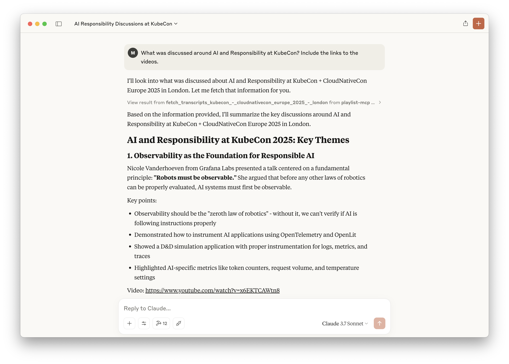

# Playlist-MCP

This is an experimental MCP server, which makes the transcripts of a Youtube Playlist available.

It currently is preloaded with the KubeCon London 2025 transcripts. But you can change this by changing the URL.



## Install

```sh
# Clone this repo
git clone git@github.com:luebken/playlist-mcp.git; cd playlist-mcp

# Install python dependencies
uv venv
source .venv/bin/activate
uv pip install -e .

# Fill the transcript cache and vector db.
uv run server.py https://www.youtube.com/playlist?list=PLj6h78yzYM2MP0QhYFK8HOb8UqgbIkLMc
```

## Setup for Claude Desktop

```sh
# Configure for Claude > Settings > Developer > Edit Config
# /Users/YOUR_USERNAME/Library/Application Support/Claude/claude_desktop_config.json
{
  "mcpServers": {
      "playlist-mcp": {
          "command": "uv",
          "args": [
              "--directory",
              "/PATH/TO/PARENT/playlist-mcp/",
              "run",
              "server.py",
              "https://www.youtube.com/playlist?list=PLj6h78yzYM2MP0QhYFK8HOb8UqgbIkLMc"
          ]
      }
  }
}
```